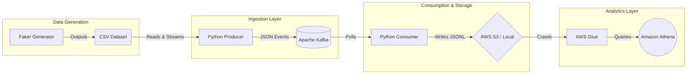

# 🚀 Scalable E-Commerce Order Streaming Pipeline

A production-grade, real-time data ingestion pipeline that reliably streams, processes, and persists e-commerce order events using **Apache Kafka**, **Python**, and **AWS S3/Athena**. 

> **Status:** 🚧 **Active Development** — Currently integrating AWS Glue metadata crawling and expanding consumer fault-tolerance.

---

## 🎯 The Problem Solved

Modern e-commerce architectures require resilient, high-throughput event ingestion to decouple order creation from downstream analytics and fulfillment systems. This pipeline explicitly solves for:
- **Decoupling & Durability:** Capturing raw order streams safely before downstream processing.
- **Data Lake Hydration:** Automatically batching and landing raw records into an S3 data lake.
- **Serverless Analytics:** Making semi-structured JSONL data immediately queryable via AWS Athena.

## 🏗️ Architecture & Data Flow



### Key Engineering Decisions:
- **Idempotent-Ready Consumer:** Designed with consumer group tracking and explicit JSON offset mapping.
- **Configurable Backpressure:** Producer handles simulated load testing via configurable event delays (`--loop` and `--delay`).
- **Cloud-Native Sink:** Extensible to sync seamlessly to AWS S3 once a bucket is provided.

---

## 📸 AWS Integration & Demo

<div align="center">
  <em>(Screenshots of the AWS Analytics Layer — S3 Bucket & Athena Query Results)</em>
  
  
  *(Replace with actual Athena screenshot)*
</div>

---

## ⚙️ Build & Run Locally

### 1. Environment & Dependencies

```bash
# Clone the repository
git clone https://github.com/your-username/kafka-orders-pipeline.git
cd kafka-orders-pipeline

# Establish virtual environment
python3 -m venv .venv
source .venv/bin/activate
pip install -r requirements.txt
cp .env.example .env
```

### 2. Stand Up Infrastructure
Boots a completely local Confluent Kafka container and Zookeeper instance.
```bash
docker-compose up -d
```
Access the local Kafka UI cluster visualizer at `http://localhost:8080`.

### 3. Execute the Pipeline
Start the Consumer (Terminal 1) to listen for the topic:
```bash
python consumer/consumer.py
```
Start the Producer (Terminal 2) to simulate incoming traffic:
```bash
# Use --loop to continuously stream data for load testing
python producer/producer.py --loop
```
*A final session summary logs throughput and durations when the consumer cleanly exits.*

---

## ☁️ Cloud Analytics Setup (AWS S3 & Athena)

1. Provision an S3 Bucket (Free Tier applicable) and define `S3_BUCKET_NAME` in your `.env`.
2. Configure your environment with valid AWS credentials (`AWS_ACCESS_KEY_ID`, `AWS_SECRET_ACCESS_KEY`).
3. Run the pipeline locally, allowing the consumer to gracefully deposit `.jsonl` payloads to S3.
4. Establish an **AWS Glue Crawler** pointing to `s3://<your-bucket>/raw/orders/`.
5. Execute serverless ad-hoc SQL queries natively in **Amazon Athena**.

---

*Built with a focus on system level thinking, scalable design patterns, and cloud-native architecture.*
